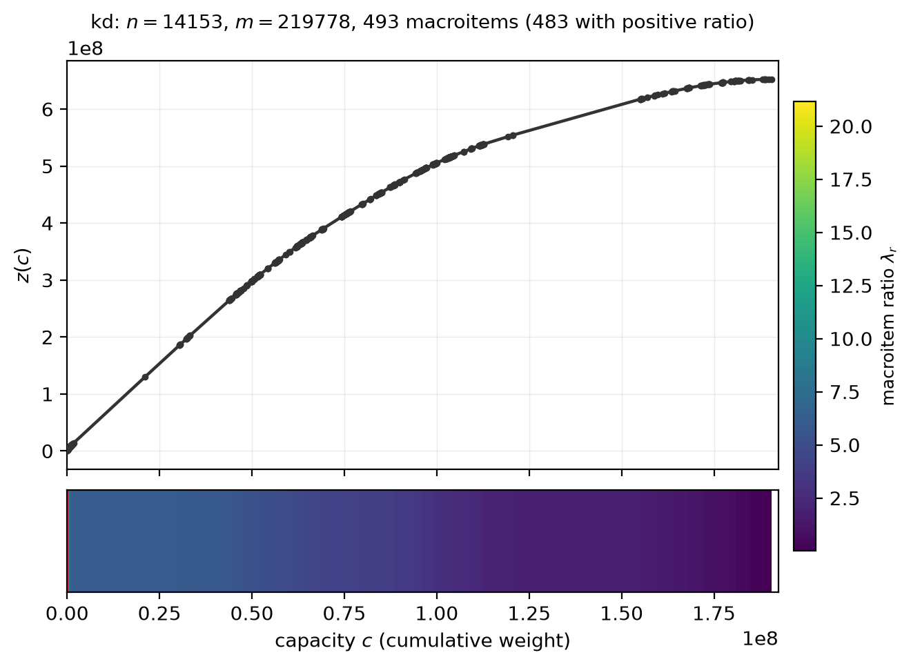

# macroitems — LP relaxation of the Precedence-Constrained Knapsack Problem

[](https://github.com/fabiofurini/macroitems/actions/workflows/ci.yml)
[](LICENSE)
[](https://www.python.org)

Python library, benchmark infrastructure and reproducible computational study
for the LP relaxation of the precedence-constrained knapsack problem, solved
through parametric maximum closure.

```
max  p'x   s.t.   w'x <= c,   x_i <= x_j for every arc (i, j),   0 <= x <= 1
```

with profits `p` of arbitrary sign, positive weights `w`, and a precedence DAG
in which an arc `(i, j)` means *j is a prerequisite of i*.

This relaxation is governed by a classical object that each of five
literatures has met under its own name — nested pits and pushbacks in mine
planning, Sidney blocks and composite jobs in scheduling, breakpoints of a
parametric minimum cut in the flow literature, maximum-ratio closures in
fractional programming. This library computes that object, and the primal and
dual certificates that go with it, under one set of conventions.

The organizing notion is a **macroitem**: a set of items treated as one
aggregated item of a knapsack. The increments of the nested parametric closure
path form a canonical sequence of macroitems with strictly decreasing
profit-to-weight ratios, and the relaxation becomes a knapsack LP on
macroitems — earlier macroitems fully selected, **one** split, the rest null.

It accompanies two manuscripts by Valerio Dose, Fabio Furini and Marco
Locatelli (see [`CITATION.cff`](CITATION.cff)).

**→ [Browse the computational report](docs/report/)** — every table, figure and
observation of the experimental study, as navigable pages.

<p align="center">
  
</p>

*MineLib `kd`: 14 153 blocks, 219 778 precedences. The upper panel is the value
function `z(c)` of the relaxation, whose breakpoints are the cumulative
macroitem points; the lower bar shows the 493 macroitems along the weight axis,
shaded by ratio, the first one outlined. One call computes all of it — every
capacity at once — in 1.2 seconds.*

## Why you might want it

**It computes every capacity at once.** The canonical sequence *is* the whole
piecewise-linear value function `z(c)`; once you have it, any capacity costs a
binary search. On an instance with 11 757 items and 83 218 arcs, the whole
value function takes 0.36 s — less than a single solve by a commercial simplex
on the same model (4.7 s), and 30× less than solving 20 capacities with one.

**It answers more than the value.** For a given capacity you also get, for
free or nearly:

* which items are `1` and which are `0` in **every** optimal solution
  (persistency), typically the overwhelming majority — 99.99% on some real
  deposits;
* a **dual certificate**: the capacity price and a flow on each region;
* **reduced costs over the whole dual optimal face**, which are stronger than
  the textbook ones and can fix variables in an enumerative algorithm;
* the **dimensions** of the primal and dual optimal faces.

**It is exact.** On integer data — and on decimal data that can be scaled —
the breakpoints are exact rationals and the cuts come from an integer
maximum-flow backend. No tolerance decides which macroitem an item belongs to.

## Install

```bash
pip install macroitems                    # core: numpy, scipy
pip install "macroitems[experiments]"     # + ortools, igraph, highspy, pandas, matplotlib
```

The optional extras are all third-party software installed under their own
licences; **this package bundles none of it**, which is how it can be MIT while
being usable with GPL and commercial software. See
[docs/solvers.md](docs/solvers.md).

## Use

```python
from macroitems import canonical_path, solve_capacity, solution_from_path
from macroitems.formats import read_minelib_upit

inst = read_minelib_upit("path/to/minelib/newman1")   # or read_pckp_dat, or Instance.read

path = canonical_path(inst)          # the whole value function, in one shot
path.k, path.q                       # number of macroitems; last with positive ratio
path.ratios                          # lambda_1 > ... > lambda_k
path.value_function(c)               # z(c) for any capacity, no further work

sol = solution_from_path(inst, path, c)
sol.value, sol.lam, sol.theta        # z(c), the capacity price, the split fill
sol.F, sol.H, sol.Z                  # full / split / null regions (Corollary 5.1)

from macroitems.dual import best_reduced_costs, fixable_items
rc = best_reduced_costs(inst, sol)                   # one minimum cut per item
fixable_items(sol, rc.value, incumbent=some_bound)   # what a branch-and-bound may fix
```

For a single capacity without the whole path, `solve_capacity(inst, c)` runs a
Newton search on the weight price and costs a handful of maximum flows.

### Command line

```bash
macroitems info      running-example
macroitems path      /path/to/minelib/kd --check --json kd_path.json
macroitems solve     /path/to/minelib/kd --capacity 0.5 --relative --dual --faces
macroitems lp        /path/to/minelib/kd --capacity 0.5 --relative --solver highs
macroitems gen grid  --nx 36 --ny 36 --nz 11 --cone 9 --seed 2 --out grid.txt
```

## What is implemented

| | |
|---|---|
| `canonical_path` | the canonical macroitem sequence, by geometric bisection (`O(k)` maximum flows on shrinking graphs) or repeated maximum-ratio extraction |
| `solve_capacity` | the LP at one capacity, by a Newton search on the weight price |
| `solution_from_path` | any capacity from a precomputed path, in `O(log k)` |
| `canonical_dual` | the canonical dual certificate: three region-wise flows |
| `best_reduced_costs` | reduced costs over the whole dual optimal face |
| `face_dimensions` | dimensions of the primal and dual optimal faces |
| `first_macroitem_lawler` | Lawler's binary search, for comparison |
| `macroitems.lp` | LP-solver baselines behind one interface (HiGHS, Gurobi, CPLEX) |
| `macroitems.formats` | readers for MineLib and for the PCKP benchmark |
| `macroitems.cli` | the `macroitems` command line |

## Correctness

`pytest` runs 773 tests in about a minute. They are not decorative: small
instances are checked against a **brute-force reference in exact rational
arithmetic** that enumerates every closure — `u(lambda)` and both lattice
extremes at every breakpoint, the canonical sequence from its definition, the
value function over a capacity grid, and persistency against the full optimal
face. Property-based tests assert the invariants on hundreds of generated
instances; the maximum-flow backends must agree; the LP baselines must agree
with the combinatorial methods to `1e-9`; and the correspondences the theory
claims with other literatures are checked by reimplementing *their*
algorithms independently — Dantzig's greedy rule with no precedences, the
subtree aggregation of Shaw and Cho on trees, and the reduced Sidney
decomposition of Margot, Queyranne and Wang computed by brute force.

## Instances

No third-party instance data is redistributed here. `macroitems.formats` reads
the published files directly:

* **MineLib** (Espinoza, Goycoolea, Moreno, Newman, *Ann. Oper. Res.* 206,
  2013) — `read_minelib_upit`, which also works out which quantity is the
  tonnage and says how it decided;
* the **PCKP benchmark** (Park and Park 1997; Boland, Bley, Fricke, Froyland,
  Sotirov, *Math. Programming* 132, 2012) — `read_pckp_dat` and `read_pckp_lp`.

See [Instances](docs/report/05-instances.md) for where to get them and what to
watch out for in the files.

## Documentation

**[The computational report](docs/report/)**, in fourteen pages:

| | |
|---|---|
| [Summary](docs/report/01-summary.md) | the answer to "how should this be solved", in one page |
| [What the library computes](docs/report/02-what-the-library-computes.md) | the objects and what they cost |
| [Definitions and conventions](docs/report/03-definitions-and-conventions.md) | **read this first** — arc direction, tie convention, regions, exact arithmetic |
| [Setup and protocol](docs/report/04-setup.md) | machine, versions, how the timings were taken |
| [Instances](docs/report/05-instances.md) | where to get them, and what to watch out for in the files |
| [Correctness](docs/report/06-correctness.md) | what the 773 tests actually check |
| [Structure of real instances](docs/report/07-structure-of-real-instances.md) | persistency, and the gap problem measured |
| [How best to solve it](docs/report/08-how-best-to-solve-it.md) | the method comparison |
| [Accuracy](docs/report/09-accuracy.md) | where the LP solvers return a wrong value |
| [Dual certificates and reduced costs](docs/report/10-dual-certificates-and-reduced-costs.md) | what the dual face buys |
| [Parametric implementations](docs/report/11-parametric-implementations.md) | why no parametric row is reported |
| [Weight against revenue factor](docs/report/12-weight-vs-revenue-factor.md) | the two nested pit families |
| [Defects found](docs/report/13-defects-found.md) | six silent wrong answers, and what caught them |
| [Reproducing this report](docs/report/14-reproducing-this-report.md) | commands and raw data |

Plus [docs/solvers.md](docs/solvers.md) — the optional backends and their
traps.

## Licence

MIT for this code. Optional dependencies keep their own licences.
