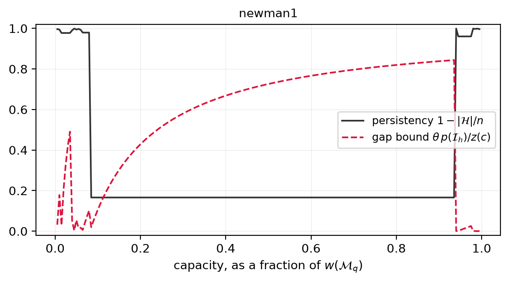

# Structure of real instances

← [Correctness](06-correctness.md) · [Contents](README.md) · next: [How best to solve it](08-how-best-to-solve-it.md)

---

Full table: [`experiments/results/tables/structure.md`](../../experiments/results/tables/structure.md).

## Persistency: how much the relaxation settles by itself

In every optimal solution, `x_i = 1` on the full region and `x_i = 0` on the
null region; only the split macroitem can differ. The fraction `1 − |H|/n` is
therefore the share of the answer the relaxation decides on its own — and it
varies enormously across real instances.

| | instance | persistency | split macroitem |
|---|---|---|---|
| lowest | O_1711_11661 | 0.150 | 1 455 of 1 711 items |
| | newman1 | 0.166 | 884 of 1 060 blocks |
| | U_6494_48626 | 0.262 | 4 790 of 6 494 |
| highest | p4hd | 0.992 | 329 of 40 947 |
| | sm2, zuck_large | 0.9999 | 10 of ~100 000 |

On sm2 and zuck_large the relaxation fixes all but ten blocks out of a hundred
thousand. On newman1 and O_1711_11661 it fixes almost nothing. This is the
*gap problem* of the mining literature, measured rather than described, and the
theory says exactly what separates the two groups: the weight of the split
macroitem relative to the capacity.

*newman1 across the capacity range. Persistency is near 1 only below 8% of
`w(M_q)`; over the entire practical range it collapses to 0.166 while the
integrality-gap bound climbs to 0.84. One macroitem dominates the instance.*

The two benchmark families behave oppositely: telecom instances decompose into
many small macroitems (persistency 0.85–0.99), mining instances into few large
ones.

## Synthetic instances do not reproduce this

Eighteen generated instances — layered block models on three grid sizes,
random DAGs with n up to 10⁵ at two densities, an out-tree, a bipartite
instance and one with deliberately tied ratios — behave far more uniformly
than real data:

| family | largest macroitem, as a share of n |
|---|---|
| layered grids (9 instances) | 48% – 65% |
| random DAGs (6 instances) | 29% – 64% |
| out-tree | 53% |
| tied ratios | 9.5% |
| bipartite | **3.3%** |

Every grid and every random graph puts between a third and two thirds of the
instance into a single macroitem, with no exception. Real deposits span four
orders of magnitude instead, from 83% on newman1 to 0.01% on sm2.

A structure generated at random therefore behaves like an unusually
unfavourable deposit, and a conclusion about the strength of the relaxation
drawn on synthetic data does not transfer to real ones. Only the bipartite
family — the shape of the hardness reductions — decomposes finely.
Raw data: [`characteristics_synthetic.csv`](../../experiments/results/characteristics_synthetic.csv).

## The published capacities sit in the hard regime

On **all 23** benchmark instances the distributed capacity is between 0.5% and
25% of `w(M_q)`. Consequently the split macroitem is the *first* one — `h = 1`
everywhere — so the optimal solution is a multiple of a single macroitem's
indicator, the integrality-gap bound is vacuous (it equals the whole LP value),
and the true gap against the known integer optima is large: median **26.6%**,
up to **85.6%** on P_3243_22306.

Worth stating plainly: the standard benchmark of this problem exercises
precisely the regime in which the natural relaxation is weakest. That is
consistent with that literature's focus on cutting planes, and it means a
practitioner reading only those papers may under-estimate what the relaxation
does at the capacities they actually face.
